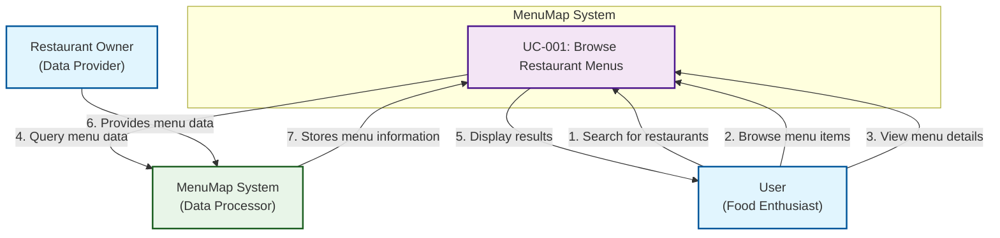
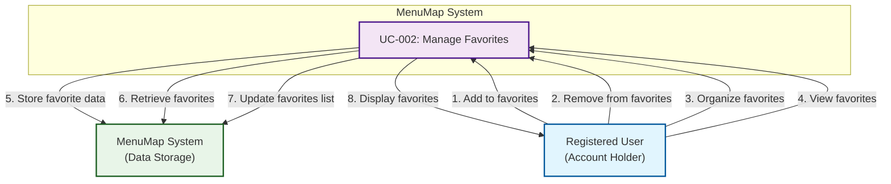
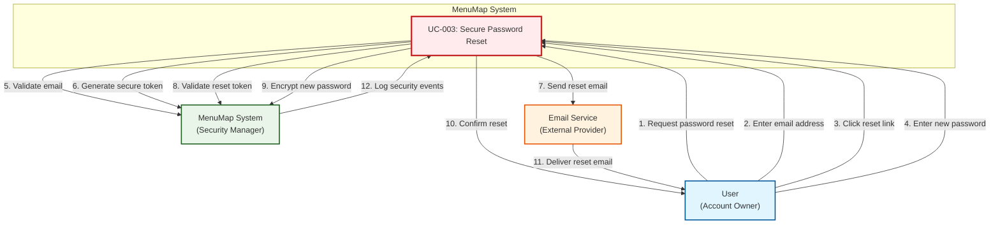
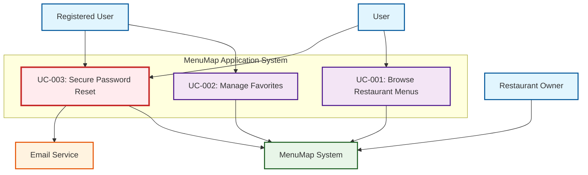

# MenuMap Use Case Diagrams
## CEN4010 Software Engineering - Team 9

**Project:** MenuMap Application 
**Team:** Team 9 
**Project Lead:** Alfonso Oramas Jr. 
**Document Author:** Andre Lewis (UML Diagrams Coordinator) 
**Date:** [Current Date] 
**Version:** 1.0 

---

## Use Case Diagram Overview

This document contains individual use case diagrams for each of the three required use cases:

1. **UC-001: Browse Restaurant Menus** (Normal Use Case)
2. **UC-002: Manage Favorites** (Normal Use Case) 
3. **UC-003: Secure Password Reset** (Security Use Case)

Each diagram shows the actors, use case, relationships, and system boundaries.

---

## UC-001: Browse Restaurant Menus - Use Case Diagram

### Diagram Description
This diagram illustrates the "Browse Restaurant Menus" use case, showing how users interact with the system to search and browse restaurant menus.

### Actors
- **User**: Primary actor who browses restaurant menus
- **Restaurant Owner**: Secondary actor who provides menu data
- **MenuMap System**: The system that processes requests and displays information

### Use Case Diagram

### Flow Description
1. **User** searches for restaurants by location, cuisine, or name
2. **User** browses through available menu items
3. **User** views detailed information about specific menu items
4. **MenuMap System** queries the database for relevant menu data
5. **MenuMap System** displays search results to the user
6. **Restaurant Owner** provides menu data to the system
7. **MenuMap System** stores and maintains menu information

---

## UC-002: Manage Favorites - Use Case Diagram

### Diagram Description
This diagram illustrates the "Manage Favorites" use case, showing how registered users save, organize, and manage their favorite restaurants and menu items.

### Actors
- **Registered User**: Primary actor who manages their favorites
- **MenuMap System**: The system that stores and retrieves user favorites

### Use Case Diagram

### Flow Description
1. **Registered User** adds restaurants or menu items to their favorites
2. **Registered User** removes items from their favorites list
3. **Registered User** organizes favorites into custom categories
4. **Registered User** views their saved favorites
5. **MenuMap System** stores favorite data in user's account
6. **MenuMap System** retrieves user's favorites when requested
7. **MenuMap System** updates the favorites list based on user actions
8. **MenuMap System** displays the organized favorites to the user

---

## UC-003: Secure Password Reset - Use Case Diagram

### Diagram Description
This diagram illustrates the "Secure Password Reset" use case, showing the security-focused process for resetting user passwords while preventing misuse and fraud.

### Actors
- **User**: Primary actor who needs to reset their password
- **MenuMap System**: The system that manages authentication and security
- **Email Service**: External service that delivers reset emails

### Use Case Diagram

### Flow Description
1. **User** requests a password reset from the login page
2. **User** enters their registered email address
3. **User** clicks the secure reset link received via email
4. **User** enters a new password meeting security requirements
5. **MenuMap System** validates the email address format and existence
6. **MenuMap System** generates a cryptographically secure, time-limited token
7. **MenuMap System** sends a password reset email through the email service
8. **MenuMap System** validates the reset token and checks expiration
9. **MenuMap System** encrypts and stores the new password securely
10. **MenuMap System** confirms the successful password reset to the user
11. **Email Service** delivers the reset email to the user's inbox
12. **MenuMap System** logs all security events for audit purposes

### Security Features Highlighted
- **Token-based Security**: Time-limited, cryptographically secure tokens
- **Email Verification**: Reset links only work with registered email addresses
- **Audit Logging**: All reset attempts are logged for security monitoring
- **Rate Limiting**: Prevents brute force attacks on password reset
- **Encryption**: New passwords are encrypted before storage

---

## Combined Use Case Overview

### System-Wide Use Case Diagram

---

## Diagram Summary

| Use Case | Type | Primary Actor | Key Relationships | Security Level |
|----------|------|---------------|-------------------|----------------|
| UC-001 | Normal | User | User ↔ System ↔ Restaurant Owner | Standard |
| UC-002 | Normal | Registered User | Registered User ↔ System | Standard |
| UC-003 | Security | User/Registered User | User ↔ System ↔ Email Service | Enhanced |

---

## Key Design Principles

### Normal Use Cases (UC-001, UC-002)
- **User-Centric Design**: Focus on user experience and ease of use
- **Data Flow**: Clear data flow between actors and system
- **Functionality**: Core application features and capabilities

### Security Use Case (UC-003)
- **Security-First Design**: Multiple layers of security and validation
- **Misuse Prevention**: Addresses potential fraud and abuse scenarios
- **Audit Trail**: Comprehensive logging and monitoring
- **External Dependencies**: Integration with external services (email)

---

## Related Documentation

- **Use Case Documentation**: Detailed descriptions of each use case
- **Software Requirements Document**: Functional and non-functional requirements
- **UML Class Diagrams**: System structure and relationships
- **Sequence Diagrams**: Detailed interaction flows
- **Security Specifications**: Implementation guidelines for security features

---

*These use case diagrams provide visual representations of the three required use cases for the MenuMap application. Each diagram shows the actors, use cases, relationships, and system boundaries, with special emphasis on security considerations for the password reset use case.*
